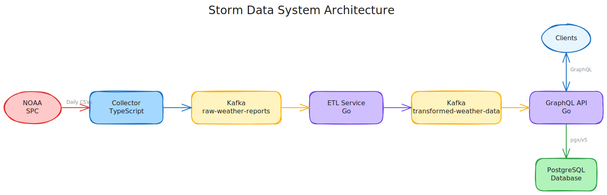
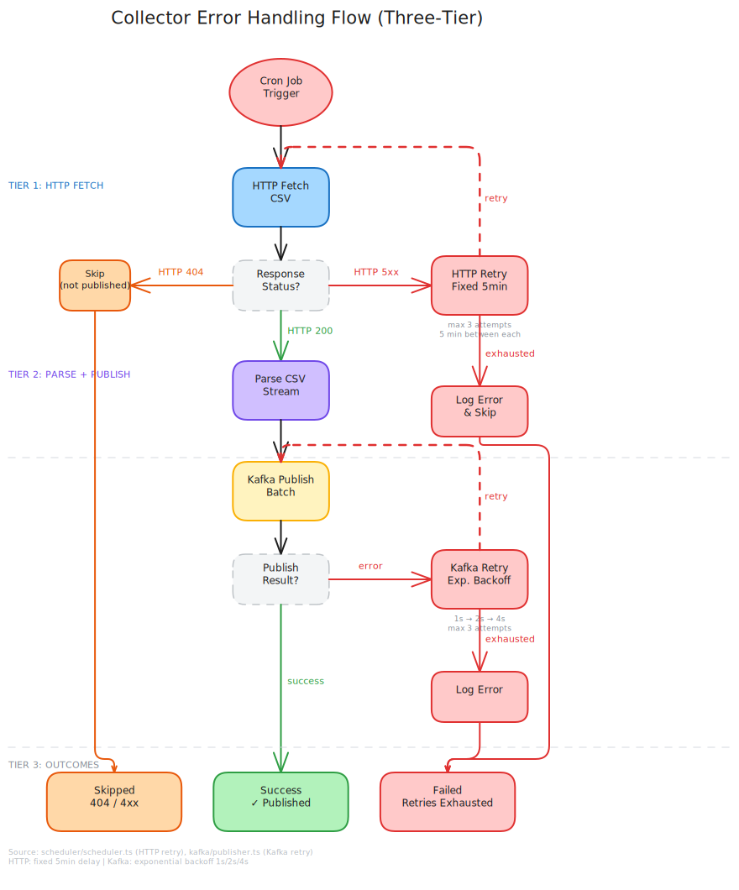

# Architecture



## Data Source

The collector fetches daily severe weather report CSVs from the [NOAA Storm Prediction Center](https://www.spc.noaa.gov/climo/reports/) (SPC). SPC publishes three CSV files per day, one per event type:

| NOAA Filename Suffix | Report Type | Magnitude Column | Magnitude Unit |
|----------------------|-------------|------------------|----------------|
| `_rpts_hail.csv` | hail | `Size` | Hundredths of inches (e.g. 125 = 1.25") |
| `_rpts_torn.csv` | tornado | `F_Scale` | Enhanced Fujita scale (EF0-EF5 or "UNK") |
| `_rpts_wind.csv` | wind | `Speed` | Miles per hour (or "UNK") |

All three types share common columns: `Time` (HHMM 24-hour), `Location` (NWS relative format, e.g. "8 ESE Chappel"), `County`, `State`, `Lat`, `Lon`, `Comments`.

**Key transformations performed by the collector:**

- `torn` -> `tornado`: NOAA's filename abbreviation is normalized to the full event type name
- A `Type` field is injected into each JSON record (`hail`, `wind`, or `tornado`)
- CSV column names are preserved as-is with capitalized keys (e.g. `Time`, `Size`, `Location`)
- All values remain as strings -- numeric parsing happens in the downstream ETL service

**Publishing schedule:** SPC typically publishes CSVs for the current day by early afternoon CT. The cron schedule should be configured accordingly (default: every 15 minutes). 404 responses indicate the CSV isn't published yet and are silently skipped.

For the full data flow from CSV to GraphQL, see the [system Data Flow documentation](https://github.com/couchcryptid/storm-data-system/wiki/Data-Flow).

## Error Handling Flow



The application implements a three-tier error handling system:

### 1. HTTP Error Handling (Fixed Interval Retry)

- **500-599 errors**: Retry with fixed 5-minute interval (max 3 attempts)
- **404 errors**: Skip (CSV not published yet)
- **400-499 errors**: Log and skip (client errors)

### 2. Kafka Publishing (Exponential Backoff Retry)

- **Success**: Messages published to Kafka topic
- **Transient failure**: Retry with exponential backoff (1s, 2s, 4s) up to 3 attempts
- **Permanent failure**: Logs error after all retries exhausted

### 3. Recovery

```
CSV Fetch → HTTP Retry Loop (5min × 3 attempts) → Kafka Publish Retry Loop (exp backoff × 3 attempts) → Log Result
```

## Retry Strategy

Fixed interval retry with `5-minute delay between attempts`

Example retry flow:

| Attempt | Delay     | Total Time |
| ------- | --------- | ---------- |
| 1       | Immediate | 0s         |
| 2       | 5 minutes | 5m         |
| 3       | 5 minutes | 10m        |
| 4       | 5 minutes | 15m        |
| Max+1   | Failure   | ~15m       |

Retries only apply to 500-599 server errors. Client errors (4xx) and network errors are not retried.

See [[Configuration]] for cron scheduling configuration.

## Design Decisions

### String-Only CSV Parsing

The collector passes CSV values through to Kafka as strings. No numeric parsing, date conversion, or type coercion happens here. The ETL service handles all type interpretation.

**Why**: The collector's job is transport, not interpretation. Keeping values as strings avoids masking data quality issues (e.g., `"UNK"` in a magnitude field) that the ETL can handle with explicit logic. It also means the collector never needs to change when downstream parsing rules evolve.

### Type Name Normalization

NOAA's filename abbreviation `torn` is normalized to `tornado` in the published JSON. A `Type` field is injected into each record.

**Why**: Downstream consumers shouldn't need to know NOAA's naming conventions. Normalizing at the source means the ETL and API never encounter the abbreviation.

### Concurrent Report Fetching

All three report types (hail, wind, tornado) are fetched concurrently via `Promise.allSettled()`.

**Why**: Report types are independent. If the tornado CSV returns 404 (not published yet), hail and wind should still succeed. `Promise.allSettled` provides this isolation naturally, unlike `Promise.all` which would fail the entire batch on a single rejection.

### Tiered Retry Strategy

HTTP fetches use fixed 5-minute interval retry (up to 3 attempts) for 5xx errors. Kafka publishing uses exponential backoff (1s, 2s, 4s) for transient failures.

**Why**: Different failure modes need different strategies. NOAA 5xx errors are typically short outages where waiting a fixed interval is appropriate. Kafka transient failures (broker election, network blip) resolve quickly, so exponential backoff avoids unnecessary delay while preventing thundering herd.

### Immediate Startup Run

The scheduler runs a collection job immediately on startup, then continues on the cron schedule.

**Why**: Faster feedback during development and after deployments. Without this, a daily cron schedule means waiting up to 24 hours to see data flow through the pipeline.

### Singleton Kafka Producer

A single KafkaJS producer instance is created on first use and reused for the application lifetime, with connection state tracked via event listeners.

**Why**: KafkaJS producer creation involves broker discovery and metadata fetching. Reusing a single instance avoids repeated overhead and provides a stable connection state for the readiness probe.

### Zod Configuration Validation

Environment variables are validated at startup using a Zod schema with defaults.

**Why**: Fail fast on misconfiguration. Zod provides both parsing and type narrowing in one step, so the rest of the application works with typed values rather than raw `process.env` strings. Invalid URLs, missing required fields, and type mismatches are caught before any work begins.

## Capacity

SPC data volumes are small (~1,000--5,000 records/day during storm season). The pipeline processes all three report types concurrently via `Promise.allSettled()` and completes in under 1 second on a typical day. Peak memory usage stays under 50--100 MB with 3 concurrent CSV streams.

The service runs once daily on a cron schedule. It is significantly over-provisioned for the expected data volume.

## Observability

The pipeline is instrumented with Prometheus metrics at key decision points:

- **Job level**: Total runs (success/failure) and duration
- **CSV level**: Fetch + process duration per report type, rows processed, rows published
- **Retry level**: Counter incremented on each 5xx retry attempt
- **Kafka publish level**: Counter incremented on each Kafka publish retry attempt

All metrics are exposed via `GET /metrics` on the same HTTP server as the health check. See the README for the full metric reference.
